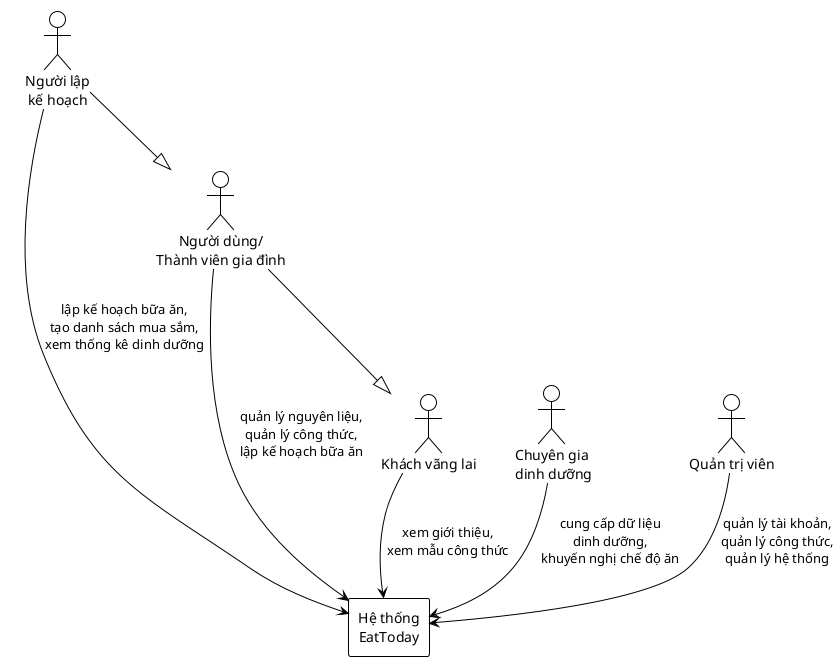
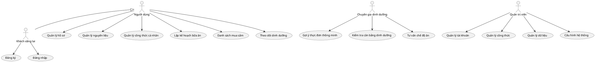
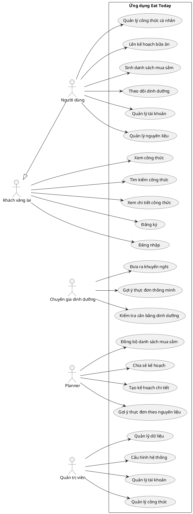
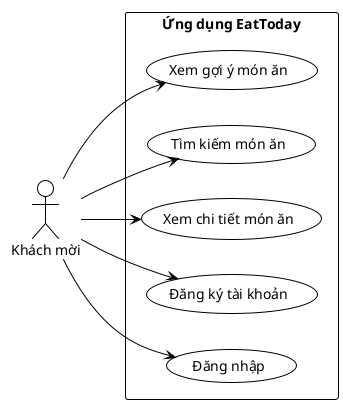
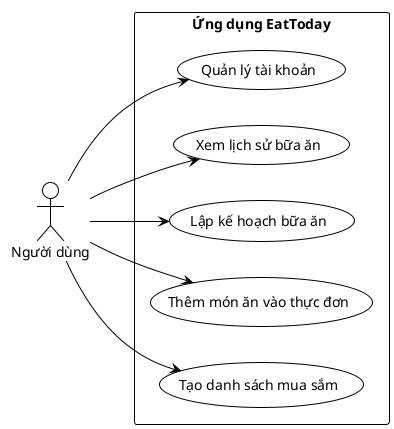
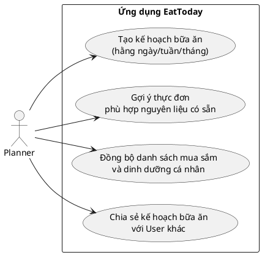
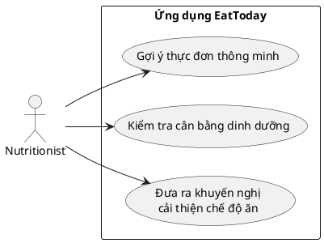
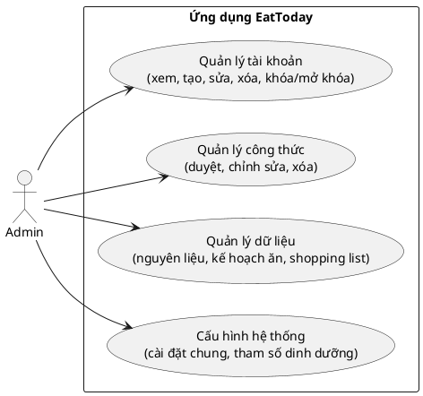

# Ứng dụng Lên Kế Hoạch Bữa Ăn Gia Đình

## I. Tổng quan dự án

### 1. Mục tiêu
Xây dựng một ứng dụng web nhằm:
- Hỗ trợ người dùng quản lý nguyên liệu sẵn có và công thức nấu ăn.  
- Tự động gợi ý thực đơn theo ngày/tuần dựa trên nhu cầu dinh dưỡng, sở thích và số lượng thành viên trong gia đình.  
- Sinh danh sách mua sắm (shopping list) từ thực đơn đã lên kế hoạch.  
- Cung cấp thống kê dinh dưỡng, đảm bảo bữa ăn cân bằng.  

### 2. Phạm vi ứng dụng
Ứng dụng tập trung vào các chức năng:
- Đăng ký/đăng nhập người dùng.  
- Quản lý nguyên liệu và công thức món ăn.  
- Lập kế hoạch bữa ăn hằng ngày/tuần.  
- Sinh danh sách mua sắm.  
- Thống kê, gợi ý dinh dưỡng cơ bản.  

Trong giai đoạn mở rộng, ứng dụng có thể tích hợp:
- AI gợi ý thực đơn thông minh.  
- Kết nối với dịch vụ giao hàng siêu thị.  
- Xuất báo cáo thực đơn ra PDF/Excel để chia sẻ.  

### 3. Giả định và Ràng buộc
- Hệ thống chỉ phục vụ cho việc lên kế hoạch bữa ăn gia đình, không phải là một nền tảng nấu ăn chuyên nghiệp hay dịch vụ giao đồ ăn.  
- Hệ thống quản lý công thức, nguyên liệu và kế hoạch bữa ăn, không phải là phần mềm kế toán, quản lý kho hay mua sắm trực tuyến toàn diện.  
- Hệ thống hỗ trợ sinh danh sách mua sắm, nhưng không tích hợp trực tiếp với siêu thị hoặc đơn vị cung cấp thực phẩm bên ngoài.  
- Hệ thống có chức năng thống kê dinh dưỡng cơ bản, không phải là một ứng dụng y tế chuyên sâu hay phần mềm theo dõi sức khỏe toàn diện.

## II Yêu cầu chức năng  
### 1 Các tác nhân  

- **Guest (Khách vãng lai):** Người dùng chưa đăng nhập, chỉ có thể xem giới thiệu ứng dụng hoặc một số công thức mẫu.  
- **User (Người dùng/Thành viên gia đình):** Người dùng có tài khoản, đăng nhập để quản lý nguyên liệu, công thức, lập kế hoạch bữa ăn.  
- **Planner (Người lập kế hoạch):** Lên kế hoạch bữa ăn, sinh danh sách mua sắm và xem thống kê dinh dưỡng.  
- **Nutritionist (Chuyên gia dinh dưỡng):** Cung cấp dữ liệu dinh dưỡng, đưa ra khuyến nghị về chế độ ăn.  
- **Admin (Quản trị viên):** Quản lý tài khoản, công thức mặc định và giám sát hệ thống.


<details>
<summary> Code PlantUML</summary>


</details>


# 2 Chức năng chính của hệ thống

## 👤 Guest (Khách vãng lai)
- Xem công thức nấu ăn: Danh sách công thức sẵn có.
- Tìm kiếm công thức: Theo nguyên liệu, loại món, hoặc chế độ ăn.
- Xem chi tiết công thức: Nguyên liệu, cách chế biến, hình ảnh, thông tin dinh dưỡng.
- Đăng ký: Tạo tài khoản mới để sử dụng đầy đủ tính năng.
- Đăng nhập: Truy cập bằng tài khoản đã đăng ký.

## 👩‍🍳 User (Người dùng)
- Quản lý tài khoản: Cập nhật thông tin cá nhân, mật khẩu, chế độ ăn.
- Quản lý nguyên liệu: Thêm, sửa, xóa nguyên liệu có sẵn trong gia đình.
- Quản lý công thức cá nhân: Lưu công thức yêu thích hoặc tự tạo công thức riêng.
- Lên kế hoạch bữa ăn: Tạo kế hoạch bữa ăn hằng ngày/tuần.
- Sinh danh sách mua sắm: Tự động tạo shopping list từ kế hoạch bữa ăn.
- Theo dõi dinh dưỡng: Thống kê calo, chất đạm, chất béo, vitamin,...

## 🥗 Nutritionist (Chuyên gia dinh dưỡng)
- Gợi ý thực đơn thông minh: Đưa ra gợi ý dựa trên nhu cầu dinh dưỡng.
- Kiểm tra cân bằng dinh dưỡng: Đánh giá chế độ ăn hiện tại.
- Đưa ra khuyến nghị: Tư vấn cải thiện bữa ăn cho người dùng.

## 📅 Planner
- Tạo kế hoạch bữa ăn chi tiết cho từng ngày/tuần/tháng.
- Gợi ý thực đơn phù hợp với nguyên liệu có sẵn.
- Đồng bộ với danh sách mua sắm và chế độ dinh dưỡng cá nhân.
- Hỗ trợ chia sẻ kế hoạch bữa ăn với User khác.

## 🛠️ Admin (Quản trị viên)
- Quản lý tài khoản: Xem, tạo, sửa, xóa, khóa/mở khóa tài khoản người dùng.
- Quản lý công thức: Duyệt, chỉnh sửa, xóa công thức trong hệ thống.
- Quản lý dữ liệu: Giám sát nguyên liệu, kế hoạch ăn, shopping list.
- Cấu hình hệ thống: Quản lý các cài đặt chung, tham số dinh dưỡng mặc định.
  
# Biểu đồ Use Case


<details>
<summary> Code PlantUML</summary>


</details>


# Biểu đồ Use Case chi tiết

<details>
<summary> Code PlantUML</summary>


</details>


# Chức năng Guest


<details>
<summary> Code PlantUML</summary>


</details>


# Chức năng User


<details>
<summary> Code PlantUML</summary>


</details>


# Chức năng Planner
<details>
<summary> Code PlantUML</summary>


</details>


# Chức năng Nutritionist

<details>
<summary> Code PlantUML</summary>


</details>


# Chức năng Admin

<details>
<summary> Code PlantUML</summary>


</details>


## Quy trình hoạt động
###  Quy trình lên kế hoạch bữa ăn
 **Thành viên gia đình**  
   - Đăng nhập ứng dụng.  
   - Chọn **"Tạo kế hoạch bữa ăn"**.  
   - Nhập số bữa, loại món (sáng/trưa/tối), khẩu vị, nguyên liệu mong muốn.  

 **Hệ thống**  
   - Lưu kế hoạch với trạng thái **"Chờ xác nhận"**.  
   - Gợi ý thực đơn dựa trên dữ liệu có sẵn.  
   - Gửi thông báo đến **Người phụ trách nấu ăn**.  

 **Người phụ trách nấu ăn**  
   - Xem kế hoạch, điều chỉnh thực đơn nếu cần.  
   - Với bữa quan trọng → gửi lên **Người lớn trong gia đình** duyệt.  

 **Người lớn trong gia đình (Bố/Mẹ/Ông/Bà)**  
   - Xem lại kế hoạch bữa ăn, chi phí và nguyên liệu.  
   - **Phê duyệt** hoặc **Yêu cầu chỉnh sửa**.  

 **Hệ thống**  
   - Cập nhật trạng thái cuối cùng.  
   - Gửi thông báo cho cả gia đình về **menu & phân công công việc**.

     
<details>
<summary>Code PlantUML</summary>
    
 ```plantuml
@startuml "Sequence - Lên kế hoạch bữa ăn"

actor "Thành viên gia đình" as User
actor "Người phụ trách nấu ăn" as Cook
actor "Người lớn trong gia đình" as Parent
actor "Cả gia đình" as All
participant "Hệ thống" as System

User -> System: Đăng nhập
User -> System: Tạo kế hoạch (số bữa, món, khẩu vị...)
System -> System: Lưu kế hoạch (Chờ xác nhận)
System -> System: Gợi ý thực đơn
System -> Cook: Gửi thông báo kế hoạch mới

Cook -> System: Xem kế hoạch
Cook -> System: Điều chỉnh thực đơn (nếu cần)
alt Bữa quan trọng
  Cook -> Parent: Gửi kế hoạch duyệt
  Parent -> System: Xem chi phí, nguyên liệu, menu
  alt Phê duyệt
    Parent -> System: Phê duyệt kế hoạch
    System -> All: Cập nhật trạng thái = "Đã phê duyệt"
  else Yêu cầu chỉnh sửa
    Parent -> System: Yêu cầu chỉnh sửa
    System -> Cook: Thông báo "Cần chỉnh sửa"
  end
end

System -> All: Gửi thông báo menu & phân công công việc

@enduml
```
</details>


## III. Các Luồng Xử Lý

### 1. Luồng xử lý: Tạo kế hoạch bữa ăn
- **Diễn viên chính**: Thành viên gia đình  
- **Mô tả**: Người dùng muốn tạo kế hoạch bữa ăn cho ngày/tuần  
- **Luồng chính**:
  1. Thành viên đăng nhập vào ứng dụng.  
  2. Chọn chức năng **"Tạo kế hoạch bữa ăn"**.  
  3. Nhập thông tin: số bữa, khẩu vị, nguyên liệu mong muốn.  
  4. Hệ thống gợi ý thực đơn.  
  5. Người dùng xác nhận kế hoạch.  
  6. Hệ thống lưu kế hoạch ở trạng thái **"Chờ xác nhận"**.  
- **Luồng phụ/ngoại lệ**:  
  - Nếu thiếu thông tin → Hệ thống yêu cầu bổ sung.  
  - Nếu không có món phù hợp → Hệ thống gợi ý thay thế từ kho công thức.
  - 
<details>
<summary>Code PlantUML</summary>
    
 ```plantuml
@startuml
left to right direction
actor "Thành viên gia đình" as Member

rectangle "Hệ thống" {
    usecase "Đăng nhập" as UC1
    usecase "Tạo kế hoạch bữa ăn" as UC2
    usecase "Nhập thông tin\n(số bữa, khẩu vị, nguyên liệu)" as UC2_1
    usecase "Gợi ý thực đơn" as UC2_2
    usecase "Xác nhận kế hoạch" as UC2_3
    usecase "Lưu kế hoạch\n[Chờ xác nhận]" as UC2_4
    
    usecase "Yêu cầu bổ sung\n(thiếu thông tin)" as UC_EXT1
    usecase "Gợi ý thay thế\n(không có món phù hợp)" as UC_EXT2
}

' Liên kết chính
Member --> UC1
Member --> UC2

UC2 --> UC2_1
UC2 --> UC2_2
UC2 --> UC2_3
UC2 --> UC2_4

' Quan hệ mở rộng
UC2_1 .u.> UC_EXT1 : <<extend>>
UC2_2 .u.> UC_EXT2 : <<extend>>
@enduml 
```
</details>


---

### 2. Luồng xử lý: Xem và chỉnh sửa kế hoạch
- **Diễn viên chính**: Người phụ trách nấu ăn  
- **Mô tả**: Kiểm tra và điều chỉnh kế hoạch bữa ăn đã tạo  
- **Luồng chính**:
  1. Người phụ trách đăng nhập.  
  2. Truy cập danh sách kế hoạch **"Chờ xác nhận"**.  
  3. Xem chi tiết kế hoạch và đề xuất chỉnh sửa (món ăn, khẩu phần, chi phí).  
  4. Lưu thay đổi.  
  5. Với bữa quan trọng → gửi lên **Người lớn trong gia đình** duyệt.  
- **Luồng phụ/ngoại lệ**:  
  - Nếu nguyên liệu không có sẵn → Đánh dấu cần đi chợ.  
  - Nếu chi phí vượt ngân sách → Cảnh báo cho người dùng.
  
<details>
<summary>Code PlantUML</summary>
    
 ```plantuml
@startuml
left to right direction
actor "Người phụ trách nấu ăn" as Cook

rectangle "Hệ thống" {
    usecase "Đăng nhập" as UC1
    usecase "Truy cập danh sách\nkế hoạch [Chờ xác nhận]" as UC2
    usecase "Xem chi tiết kế hoạch\n(món, khẩu phần, chi phí)" as UC3
    usecase "Chỉnh sửa kế hoạch" as UC4
    usecase "Lưu thay đổi" as UC5
    usecase "Gửi duyệt kế hoạch\nbữa quan trọng" as UC6
    
    usecase "Đánh dấu cần đi chợ\n(nếu thiếu nguyên liệu)" as EXT1
    usecase "Cảnh báo chi phí vượt ngân sách" as EXT2
}

Cook --> UC1
Cook --> UC2
UC2 --> UC3
UC3 --> UC4
UC4 --> UC5
UC5 --> UC6

' Ngoại lệ
UC3 .u.> EXT1 : <<extend>>
UC4 .u.> EXT2 : <<extend>>
@enduml
```
</details>


---

### 3. Luồng xử lý: Phê duyệt kế hoạch
- **Diễn viên chính**: Người lớn trong gia đình (Bố/Mẹ/Ông/Bà)  
- **Mô tả**: Duyệt hoặc từ chối kế hoạch bữa ăn quan trọng  
- **Luồng chính**:
  1. Người lớn đăng nhập.  
  2. Truy cập danh sách kế hoạch cần phê duyệt.  
  3. Xem thông tin: thực đơn, chi phí, nguyên liệu.  
  4. Chọn **Phê duyệt** hoặc **Từ chối**.  
  5. Hệ thống cập nhật trạng thái kế hoạch.  
- **Luồng phụ/ngoại lệ**:  
  - Nếu từ chối → hệ thống trả về trạng thái **"Cần chỉnh sửa"** và thông báo cho người phụ trách.  

<details>
<summary>Code PlantUML</summary>
    
 ```plantuml
@startuml
left to right direction
actor "Người lớn trong gia đình\n(Bố/Mẹ/Ông/Bà)" as Parent

rectangle "Hệ thống" {
    usecase "Đăng nhập" as UC1
    usecase "Truy cập danh sách\ncần phê duyệt" as UC2
    usecase "Xem thông tin\n(thực đơn, chi phí, nguyên liệu)" as UC3
    usecase "Phê duyệt kế hoạch" as UC4
    usecase "Từ chối kế hoạch" as UC5
    usecase "Cập nhật trạng thái kế hoạch" as UC6
    usecase "Trả về 'Cần chỉnh sửa'\nvà thông báo cho người phụ trách" as EXT1
}

Parent --> UC1
Parent --> UC2
UC2 --> UC3
UC3 --> UC4
UC3 --> UC5
UC4 --> UC6
UC5 --> UC6

' Ngoại lệ
UC5 .u.> EXT1 : <<extend>>
@enduml
```
</details>


---

### 4. Luồng xử lý: Đi chợ & chuẩn bị bữa ăn
- **Diễn viên chính**: Người đi chợ, Người nấu ăn  
- **Mô tả**: Sau khi kế hoạch được duyệt, các công việc được phân công  
- **Luồng chính**:
  1. Ứng dụng phân công công việc (ai đi chợ, ai nấu, ai dọn).  
  2. Người đi chợ xem danh sách nguyên liệu cần mua.  
  3. Người nấu ăn xem công thức, bước chế biến.  
  4. Sau khi hoàn tất, đánh dấu công việc **Hoàn thành**.  
- **Luồng phụ/ngoại lệ**:  
  - Nếu thiếu nguyên liệu → có thể cập nhật thay thế trong ứng dụng.  
  - Nếu có sự thay đổi đột xuất → Người dùng khác có thể nhận thay công việc.  

<details>
<summary>Code PlantUML</summary>
    
 ```plantuml
@startuml
left to right direction
skinparam packageStyle rectangle

rectangle "Hệ thống Eat Today" {
  usecase "Phân công công việc" as UC1
  usecase "Xem danh sách nguyên liệu cần mua" as UC2
  usecase "Xem công thức & bước chế biến" as UC3
  usecase "Đánh dấu hoàn thành" as UC4
  usecase "Cập nhật thay thế nguyên liệu" as UC5
}

actor "Người đi chợ" as Shopper
actor "Người nấu ăn" as Cook

Shopper --> UC1
Cook --> UC1

Shopper --> UC2
Cook --> UC3

Shopper --> UC4
Cook --> UC4

Shopper --> UC5


Shopper --> UpdateIngredient
Cook --> UpdateIngredient
@enduml
```
</details>


---

### 5. Luồng xử lý: Thông báo & nhắc nhở
- **Diễn viên chính**: Hệ thống  
- **Mô tả**: Gửi thông báo cho các thành viên  
- **Luồng chính**:
  1. Gửi thông báo khi có kế hoạch mới được tạo.  
  2. Gửi thông báo khi kế hoạch được duyệt hoặc yêu cầu chỉnh sửa.  
  3. Nhắc nhở khi đến giờ đi chợ/nấu ăn/dọn dẹp.  
  4. Thông báo kết quả sau khi bữa ăn hoàn thành.

<details>
<summary>Code PlantUML</summary>
    
 ```plantuml
@startuml
left to right direction
actor "Hệ thống" as System

rectangle "Ứng dụng" {
    usecase "Thông báo khi có kế hoạch mới" as UC1
    usecase "Thông báo khi kế hoạch được duyệt\nhoặc yêu cầu chỉnh sửa" as UC2
    usecase "Nhắc nhở khi đến giờ đi chợ /\nnấu ăn / dọn dẹp" as UC3
    usecase "Thông báo kết quả sau khi\nbữa ăn hoàn thành" as UC4
}

System --> UC1
System --> UC2
System --> UC3
System --> UC4
@enduml
```
</details>


  ## IV. Các trạng thái thực thể trong hệ thống

### 1. Trạng thái Kế hoạch bữa ăn
<details>
<summary>Code PlantUML</summary>
    
 ```plantuml
@startuml
state "Mới tạo" as MoiTao
state "Chờ xác nhận" as ChoXacNhan
state "Chờ phê duyệt" as ChoPheDuyet
state "Đã phê duyệt" as DaPheDuyet
state "Bị từ chối/Chỉnh sửa" as TuChoi
state "Đang thực hiện" as DangThucHien
state "Hoàn thành" as HoanThanh

MoiTao --> ChoXacNhan
ChoXacNhan --> ChoPheDuyet : Nếu là bữa quan trọng
ChoXacNhan --> DaPheDuyet : Nếu được chấp thuận ngay
ChoPheDuyet --> DaPheDuyet : Được phê duyệt
ChoPheDuyet --> TuChoi : Không đồng ý
DaPheDuyet --> DangThucHien
DangThucHien --> HoanThanh
DangThucHien --> TuChoi : Có lỗi / cần chỉnh sửa
TuChoi --> ChoXacNhan
@enduml
```
</details>


---

### 2. Trạng thái Món ăn
<details>
<summary>Code PlantUML</summary>
    
 ```plantuml
@startuml
state "Đang gợi ý" as GoiY
state "Đang chọn" as DangChon
state "Đã chọn" as DaChon
state "Đang chuẩn bị" as DangChuanBi
state "Hoàn thành" as HoanThanh
state "Bị loại bỏ" as BiLoaiBo

GoiY --> DangChon
DangChon --> DaChon
DangChon --> BiLoaiBo
DaChon --> DangChuanBi
DangChuanBi --> HoanThanh
DaChon --> BiLoaiBo
@enduml
```
</details>


---

### 3. Trạng thái Công việc
<details>
<summary>Code PlantUML</summary>
    
 ```plantuml
@startuml
state "Chưa bắt đầu" as ChuaBatDau
state "Đang thực hiện" as DangThucHien
state "Hoàn thành" as HoanThanh
state "Bị hoãn" as BiHoan

ChuaBatDau --> DangThucHien
DangThucHien --> HoanThanh
DangThucHien --> BiHoan
BiHoan --> DangThucHien
@enduml
```
</details>


## V. Yêu cầu phi chức năng

###  Hiệu suất
-  **Tải trang**: Thời gian tải các màn hình chính (trang kế hoạch, thực đơn, danh sách công việc) không quá **3 giây**.  
-  **API phản hồi**: Thời gian phản hồi cho các API quan trọng (tạo kế hoạch, đồng bộ công việc, xem thực đơn) không quá **1 giây**.  
-  **Chịu tải đồng thời**: Hệ thống phải hỗ trợ ổn định khi có tối thiểu **20 thành viên** cùng lúc truy cập, chỉnh sửa kế hoạch hoặc cập nhật thực đơn.  
-  **Tài nguyên tối ưu**: Hình ảnh món ăn và tài nguyên tĩnh (CSS/JS) phải được nén để giảm thời gian tải.  

###  Bảo mật
-  **Mã hóa dữ liệu**: Thông tin người dùng (tài khoản, chế độ ăn, lịch sử bữa ăn) phải được mã hóa mạnh trong cơ sở dữ liệu.  
-  **Chống tấn công**: Hệ thống có cơ chế phòng chống SQL Injection, Cross-Site Scripting và CSRF.  
-  **Logging**: Ghi lại các hoạt động quan trọng như đăng nhập, tạo/ký duyệt kế hoạch, chỉnh sửa thực đơn.  
-  **Sao lưu định kỳ**: Dữ liệu (kế hoạch, công thức món ăn) phải được sao lưu tự động theo định kỳ.  

###  Khả năng mở rộng
-  **Kiến trúc Module**: Hệ thống xây dựng theo kiến trúc module để dễ dàng bảo trì và thêm tính năng mới (ví dụ: theo dõi dinh dưỡng, thống kê chi phí).  
-  **Tích hợp bên thứ ba**: Sẵn sàng tích hợp với dịch vụ mua sắm online hoặc ứng dụng quản lý sức khỏe.  
-  **Tài liệu hóa**: Cung cấp tài liệu API rõ ràng cho các nhà phát triển muốn mở rộng ứng dụng.  

###  Giao diện người dùng
-  **Thiết kế đáp ứng (Responsive)**: Giao diện hiển thị tốt trên mọi kích thước màn hình, từ điện thoại đến máy tính bảng và PC.  
-  **Dễ sử dụng**: Người dùng mới có thể làm quen và sử dụng các chức năng chính (tạo kế hoạch, xem thực đơn, phân công công việc) trong vòng dưới **15 phút**.  
-  **Tính nhất quán**: Giao diện và luồng hoạt động đồng bộ trên toàn bộ hệ thống.  

###  Tương thích
-  **Trình duyệt**: Hoạt động tốt trên Chrome, Firefox, Safari, Edge.  
-  **Thiết bị di động**: Tương thích với Android và iOS.  
-  **Tối ưu kết nối**: Ứng dụng vẫn hoạt động mượt mà ngay cả khi kết nối Internet chậm.  

###  Độ tin cậy
-  **Uptime**: Hệ thống hoạt động ổn định tối thiểu **99.5%**.  
-  **Phục hồi sau sự cố**: Thời gian phục hồi hệ thống không quá **2 giờ** sau khi xảy ra sự cố.  
-  **Kế hoạch dự phòng**: Có phương án dự phòng cho cơ sở dữ liệu và máy chủ.  

###  Khả năng bảo trì
-  **Clean Code**: Mã nguồn tuân thủ tiêu chuẩn clean code, dễ đọc và dễ mở rộng.  
-  **Tài liệu kỹ thuật**: Các chức năng quan trọng và quyết định kiến trúc phải được ghi chú rõ ràng.  
-  **Khả năng Rollback**: Có quy trình triển khai cho phép dễ dàng quay lại phiên bản ổn định nếu bản cập nhật mới gặp sự cố.  
